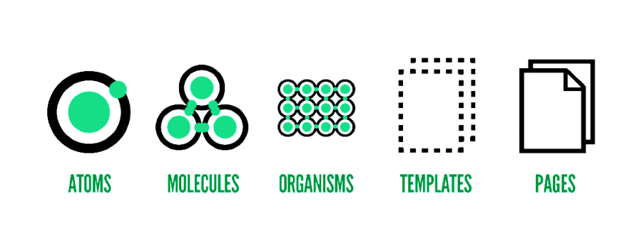

# コンポーネント設計の基本
- コンポーネントが持つ4つの特徴
  - カプセル化されている  
  コンポーネントを利用するインターフェースだけ分かっていれば、内部の実装を気にする必要がない状態。  
  - 置き換え可能である  
  同じ機能を持つ異なる見た目のUIと差し替える場合に、インターフェースを限定しておく事で他のコンポーネントに置き換えが可能になるようにする。
  - **再利用可能である**  
  開発者が必要な追加機能をなんとなく実装しやすい場所に実装しているとコンポーネントの機能が過剰になり、再利用性が落ちる。**開発者はコンポーネントに課した責務を意識することが重要。**
  - 組み合わせで大きなコンポーネントを作成可能である  
  コンポーネント単体は小さな問題解決しかできないが、大きな問題もコンポーネント単位で砕いて振り分け、コンポーネントを集めて解決する。一つのコンポーネント毎に役割が別れているので1つ1つのコンポーネントの持つ問題を小さくする。

 

# コンポーネント設計のポイント
- 単一責任の分割  
  1コンポーネントが持つ責任を持つ問題は1つに絞る。コンポーネントが複数の問題を解決するように設計されていると変更による影響が分かりにくくなり不具合の原因となる。一つに絞られていれば、原因の追求が容易になる。
- 関心の分離  
  担当する機能を目的別に分離すること。UIにおける関心の分離をどのようにすれば再利用性が高く、組み合わせやすいコンポーネントを作れるかという事を解決するのがAtomicDesignという手法。

 

# UIコンポーネントの分割基準
- 分割基準の5要素  

- Atoms / 原子  
  Atoms層は、UIコンポーネントとしての最小単位。それ以上UIとしての機能性を破壊しない最小要素。最大限抽象化した機能しか持たない。
  - button
  - text field
  - icon
  - title etc...
- Molecules / 分子  
  Atoms層のコンポーネントを複数合わせて作成する。Atoms層ではボタンをクリックやテキストを入力するだけで、ユーザーがどんな動機でそれを行うかが抜けている。Molecules層ではこのユーザーが何のためにボタンをクリックするのか何のためにテキストを入力するのかといった、ユーザーの具体的な動機に応える機能単位でUIをコンポーネント化する。**ユーザーが意識してやりたいと思っている事に対して機能を提供する**
  - 検索フォーム button + text field
  - ログインフォーム button + text field + label etc...

 

# Dashboardに活かすべき視点
- 再利用可能であるという事。  
取り回ししやすいようにしたはずだが、追加機能をいれている内に取り回しにくい物も増えてきている。要は一つのコンポーネントに課している機能が過剰ということ。
  - DatatableやSimpletableのテーブル周りが特に絡まっている。
- 単一責任の分割  
この辺りは、上記の課題と被るが今後、MoleculesとAtomicというOrganismsよりコンポーネントを砕いて分ける必要がある。